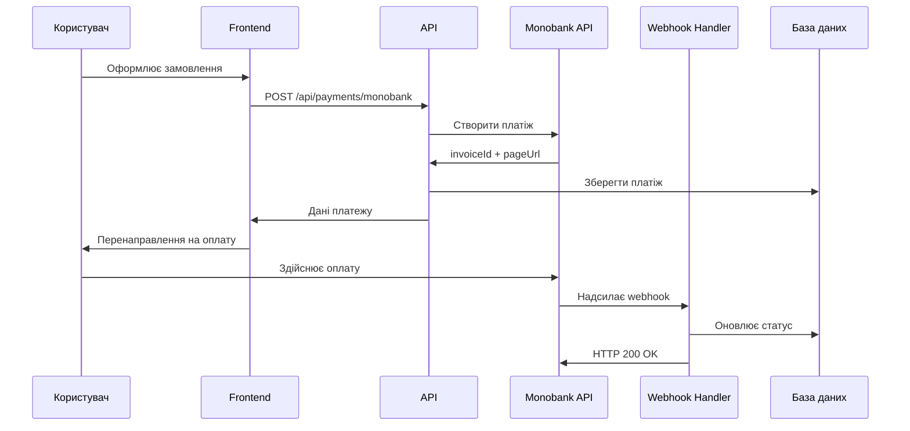

# Інтеграція платіжної системи Monobank

## Огляд

Цей документ описує повну інтеграцію платіжної системи Monobank в проект Stefa.books. Інтеграція включає створення платежів, обробку webhook'ів, валідацію підписів та інтеграцію в процес замовлення.

## Архітектура інтеграції

### Основні компоненти

1. **MonobankService** (`src/lib/services/monobank.ts`) - основний клас для роботи з API Monobank
2. **Типи даних** (`src/lib/types/monobank.ts`) - TypeScript типи для API
3. **API endpoints** (`src/app/api/payments/monobank/`) - REST API для фронтенду
4. **React компоненти** (`src/components/payment/`) - UI компоненти для платежів
5. **Хуки** (`src/hooks/useMonobankPayment.ts`) - React хуки для роботи з платежами

### Схема роботи



## Налаштування

### Змінні середовища

Додайте до `.env.local`:

```env
# Monobank API configuration
MONOBANK_API_URL=https://api.monobank.ua/api/merchant
MONOBANK_PUBLIC_KEY=your_public_key_here
MONOBANK_PRIVATE_KEY=your_private_key_here
MONOBANK_MERCHANT_ID=your_merchant_id_here

# Site URL for redirects and webhooks
NEXT_PUBLIC_SITE_URL=https://stefa-books.com.ua
```

### Отримання ключів від Monobank

1. Зареєструйтеся в Monobank Business
2. Підключіть послугу еквайрингу
3. В особистому кабінеті отримайте:
   - Публічний ключ (для валідації webhook'ів)
   - Приватний ключ (для API запитів)
   - ID мерчанта

### Налаштування webhook'ів

URL webhook'у: `https://your-domain.com/api/payments/monobank/webhook`

Webhook повинен бути налаштований в особистому кабінеті Monobank для отримання уведомлень про зміну статусу платежів.

## Використання

### Створення платежу

```typescript
import { monobankService } from '@/lib/services/monobank';

const paymentResult = await monobankService.createPayment({
  amount: 500, // сума в гривнях
  description: 'Підписка Maxi - Книга для дитини',
  reference: 'order-123', // унікальний ідентифікатор замовлення
  redirectUrl: 'https://stefa-books.com.ua/payment/success',
  webhookUrl: 'https://stefa-books.com.ua/api/payments/monobank/webhook'
});

if (paymentResult.status === 'success') {
  const { invoiceId, pageUrl } = paymentResult.data!;
  // Перенаправити користувача на pageUrl для оплати
}
```

### Перевірка статусу платежу

```typescript
const statusResult = await monobankService.checkPaymentStatus(invoiceId);

if (statusResult.status === 'success') {
  const { status, amount, reference } = statusResult.data!;
  console.log(`Payment ${invoiceId} status: ${status}`);
}
```

### Використання React компоненту

```tsx
import MonobankPayment from '@/components/payment/MonobankPayment';

function CheckoutPage() {
  const handlePaymentSuccess = (paymentData: any) => {
    console.log('Payment successful:', paymentData);
    // Перенаправити на сторінку успіху
  };

  const handlePaymentError = (error: string) => {
    console.error('Payment failed:', error);
    // Показати помилку користувачу
  };

  return (
    <MonobankPayment
      amount={500}
      description="Підписка Maxi"
      currency="UAH"
      customerEmail="user@example.com"
      customerName="Іван Петров"
      onPaymentSuccess={handlePaymentSuccess}
      onPaymentError={handlePaymentError}
    />
  );
}
```

### Використання хуків

```tsx
import { useMonobankPayment } from '@/hooks/useMonobankPayment';

function PaymentComponent() {
  const { 
    payment, 
    loading, 
    error, 
    paymentStatus, 
    createPayment,
    checkPaymentStatus 
  } = useMonobankPayment();

  const handleCreatePayment = () => {
    createPayment({
      amount: 500,
      description: 'Test payment',
      customer_email: 'test@example.com',
      customer_name: 'Test User'
    });
  };

  return (
    <div>
      {loading && <p>Створюємо платіж...</p>}
      {error && <p>Помилка: {error}</p>}
      {payment && (
        <div>
          <p>Платіж створено: {payment.invoice_id}</p>
          <a href={payment.payment_url}>Сплатити</a>
        </div>
      )}
      <button onClick={handleCreatePayment}>
        Створити платіж
      </button>
    </div>
  );
}
```

## API Endpoints

### POST /api/payments/monobank

Створення нового платежу.

**Параметри запиту:**
```typescript
{
  amount: number;           // Сума в гривнях
  description: string;      // Опис платежу
  currency?: string;        // Валюта (за замовчуванням UAH)
  customer_email: string;   // Email користувача
  customer_name: string;    // Ім'я користувача
  order_id: string;         // ID замовлення
  return_url?: string;      // URL повернення після оплати
}
```

**Відповідь:**
```typescript
{
  success: boolean;
  payment?: {
    invoice_id: string;     // ID інвойсу
    status: string;         // Статус платежу
    payment_url: string;    // URL для оплати
    amount: number;         // Сума
    currency: string;       // Валюта
    expires_at: string;     // Час закінчення дії посилання
    created_at: string;     // Час створення
  };
  error?: string;           // Помилка, якщо є
}
```

### GET /api/payments/monobank?invoice_id={id}

Перевірка статусу платежу.

**Параметри:**
- `invoice_id` - ID інвойсу для перевірки

**Відповідь:**
```typescript
{
  success: boolean;
  payment?: {
    invoice_id: string;
    status: string;         // pending, success, failed, expired
    amount: number;
    currency: string;
    created_at: string;
    modified_at: string;
    reference: string;
  };
  error?: string;
}
```

### POST /api/payments/monobank/webhook

Обробка webhook'ів від Monobank. Автоматично оновлює статус платежів в базі даних.

**Заголовки:**
- `X-Sign` - підпис webhook'у для валідації

**Тіло запиту:**
```typescript
{
  invoiceId: string;
  status: 'success' | 'failure' | 'process';
  amount: number;          // Сума в копійках
  ccy: number;            // Код валюти (980 для UAH)
  reference: string;       // Reference з створення платежу
  createdDate: number;     // Timestamp створення
  modifiedDate: number;    // Timestamp останньої зміни
}
```

## Безпека

### Валідація webhook'ів

Всі webhook'и від Monobank валідуються за допомогою HMAC підпису:

```typescript
// Автоматичний виклик в MonobankService
const isValid = monobankService.validateWebhook(requestBody, signature);

if (!isValid) {
  return NextResponse.json(
    { success: false, error: 'Invalid signature' },
    { status: 401 }
  );
}
```

### Захист від повторних webhook'ів

Система автоматично обробляє повторні webhook'и та оновлює статус платежу без створення дублікатів.

### Логування

Всі операції логуються через систему логування проекту:

```typescript
import { logger } from '@/lib/logger';

logger.info('Payment created', { invoiceId, amount, reference });
logger.error('Payment failed', { error, invoiceId });
```

## База даних

### Таблиця payments

Платежі зберігаються в існуючій таблиці `payments`:

```sql
-- Приклад запиту для створення платежу
INSERT INTO payments (
  transaction_id,    -- invoice_id від Monobank
  amount,           -- сума в гривнях
  description,      -- опис платежу
  payment_status,   -- pending, success, failed
  payment_method,   -- 'monobank'
  currency,         -- 'UAH'
  metadata          -- додаткова інформація (reference, provider)
) VALUES (...);
```

### Статуси платежів

- `pending` - платіж створено, очікує оплати
- `success` - платіж успішно завершено
- `failed` - платіж не вдався
- `expired` - час дії платежу закінчився

## Тестування

### Юніт тести

Запуск тестів:

```bash
pnpm test src/__tests__/monobank-integration.test.ts
```

Тести покривають:
- Створення платежів
- Перевірку статусу
- Обробку webhook'ів
- Валідацію підписів
- Обробку помилок

### Тестове середовище

Monobank надає тестове середовище для розробки. Використовуйте тестові ключі в `.env.local` для розробки.

### Мануальне тестування

1. Створіть тестовий платіж через API
2. Перейдіть за посиланням для оплати
3. Використайте тестові картки від Monobank
4. Перевірте отримання webhook'у
5. Переконайтеся, що статус оновився в базі даних

## Моніторинг та логи

### Ключові метрики

- Кількість створених платежів
- Успішність платежів (%)
- Час обробки webhook'ів
- Помилки API

### Алерти

Налаштуйте алерти на:
- Помилки створення платежів
- Невалідні webhook'и
- Timeout'и API запитів
- Критичні помилки в логах

## Розгортання

### Production checklist

- [ ] Налаштовані production ключі від Monobank
- [ ] Webhook URL доступний з інтернету
- [ ] HTTPS сертифікат налаштований
- [ ] Логування працює
- [ ] Моніторинг налаштований
- [ ] Backup стратегія для бази даних
- [ ] Тести проходять

### Змінні середовища production

```env
MONOBANK_API_URL=https://api.monobank.ua/api/merchant
MONOBANK_PUBLIC_KEY=prod_public_key
MONOBANK_PRIVATE_KEY=prod_private_key
MONOBANK_MERCHANT_ID=prod_merchant_id
NEXT_PUBLIC_SITE_URL=https://stefa-books.com.ua
```

## Подальший розвиток

### Можливі покращення

1. **Підтримка розстрочки** - інтеграція з Monobank розстрочкою
2. **Рекурентні платежі** - автоматичне списання за підписку
3. **Multi-currency** - підтримка інших валют
4. **Аналітика платежів** - детальна звітність
5. **Відшкодування** - автоматичні refund'и

### Альтернативні методи оплати

Інтеграцію можна розширити додатковими методами:
- Apple Pay / Google Pay
- LiqPay (PrivatBank)
- Wayforpay
- Portmone

## Підтримка

### Документація Monobank

- [Офіційна документація API](https://api.monobank.ua/docs/acquiring.html)
- [Приклади інтеграції](https://github.com/monobank)

### Контакти

- Технічна підтримка Monobank: support@monobank.ua
- Документація проекту: `CLAUDE.md`
- Тестування: `src/__tests__/monobank-integration.test.ts`

---

*Документація актуальна станом на 2025-01-12. При оновленні API Monobank необхідно оновити відповідні компоненти.*